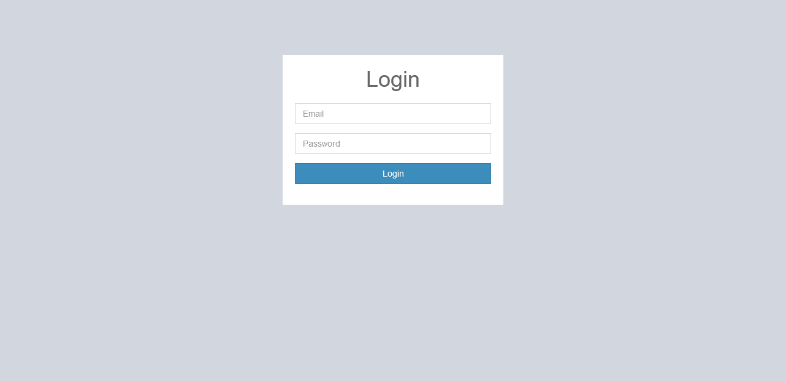
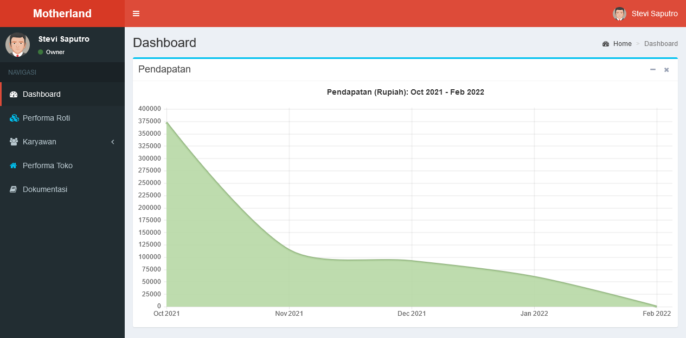
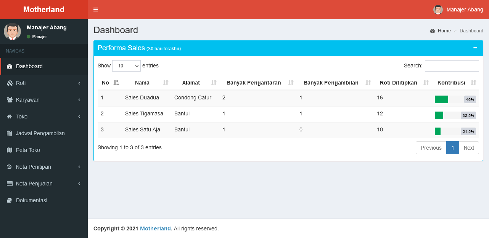
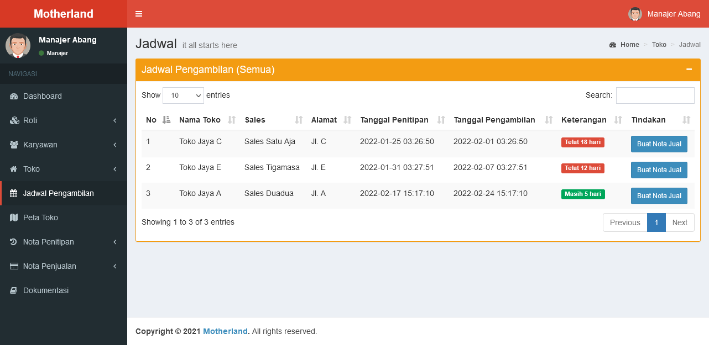
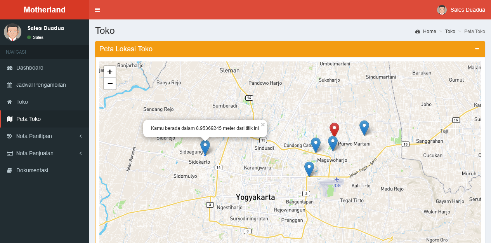
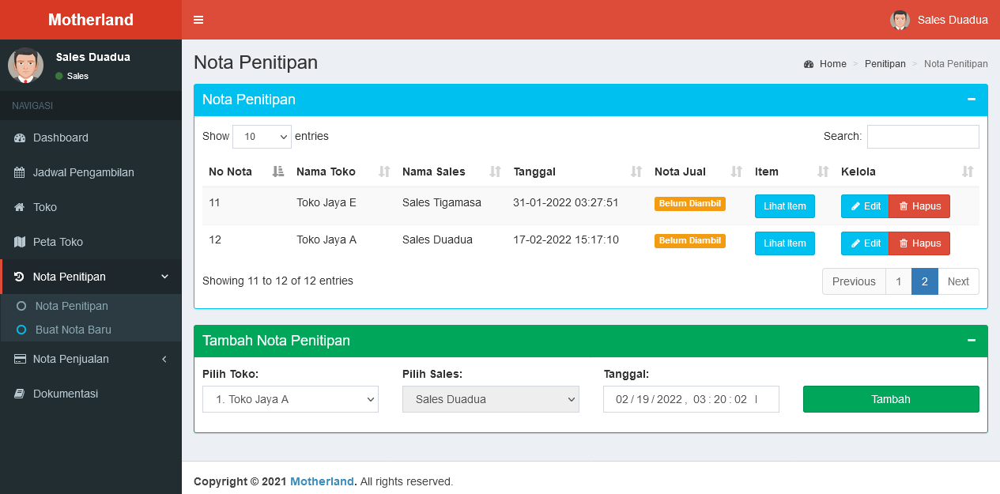

# About
Aplikasi web untuk perusahaan roti untuk penjualan secara konsinyasi atau jual titip. Model aplikasi mengikuti metode konvensional dimana saat sales mengantarkan roti melakukan pencatatan nota untuk roti yang dititipkan dan nota hasil penjualan pada waktu berikutnya.

## Screenshot

#### Owner

#### Manajer

#### Sales

## Setup (Windows)
Menggunakan XAMPP
1. Buat folder `web` di `htdocs`
2. Download file project
3. Masukkan file project ke dalam folder `web`. Pastikan struktur file `\htdocs\web\md\`

## Peringatan
Cek versi PHP yang digunakan adalah versi 5.6 sampai versi 7.4, versi diatasnya menimbulkan bug dan error karena tidak didukung oleh CodeIgniter 3.